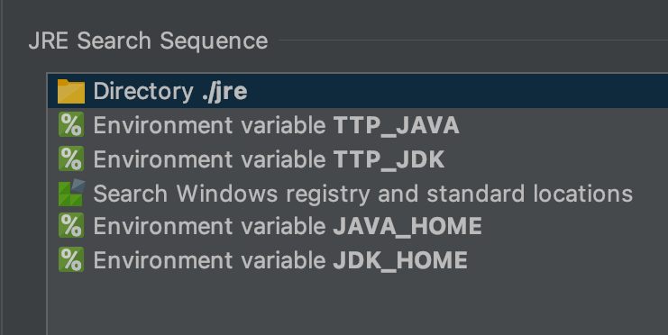

# Wiki

---
## 一、下载说明

> 目前仅支持macOS、Windows平台，暂不支持Linux平台

`安装包命名规范`：jTTPlayer - <平台> - [架构] - [Bundle/Folder] - [Mini] - <版本号>.<文件后缀>  
`注意`：普通用户一般建议下载`非 Mini`版本；当然，若想尝试`Mini`版本，试一试也无妨！

### 1、规范
- <>表示一定存在；[]表示不一定存在
- 平台：包括macOS、Windows、Linux等
- 架构：`若不标明，即为通用指令架构`；通常为x86、x86_64、x64、amd64、arm64、aarch64等，具体请自行AI
- Bundle：单文件安装包/程序包；安装/解压缩后为.app、.exe的单文件程序
- Folder：目录安装包；安装后，会在`安装目录`下生成目录；或解压缩后生成目录；程序文件包含在该目录里面
- macOS-Bundle：<b>`不支持macOS 14及以上`</b>
- macOS-Folder：<b>`macOS 14及以上请选择该安装包`</b>
- Mini：顾名思义，文件大小`相对迷你`，`不包含运行环境`；用户`须自行配置JDK/JRE`运行环境后，方可运行
- zip压缩包：一般为`免安装`版本，即解压缩后，在JDK/JRE运行环境有效时，无需再进行安装可直接运行

### 2、Mini版本
> <b>`注意`：JDK/JRE必须为`带JavaFX 1.8.0_xxx`版本，非1.8版本将无法运行</b>

Mini版本为作者自研，并移除JRE后打包的版本；若无法使用，请下载非Mini的完整版本

#### 2.1、Windows
在Windows平台上，设置了JDK/JRE运行环境`固定的查找顺序`，如图所示：  

> 翻译一下，`JRE查找顺序`：
1. 同级jre目录：目录名称为`jre`，且与jTTPlayer.exe在`相同目录`下
2. 环境变量：变量名称为`TTP_JAVA`、或者`TTP_JDK`；专为jTTPlayer自定义的，配置其中一个即可
3. 注册表、标准路径（安装JDK/JRE时的默认路径）
4. 环境变量：变量名称为`JAVA_HOME`、或者`JDK_HOME`

> 了解`JRE查找顺序`后，该如何配置？思路如下：
- 选择上面顺序中的其中一个方式设置，让jTTPlayer知道上哪里找到JRE即可
- (不推荐)`顺序1`的方式，大概可直接忽略，采用同级jre目录，这和直接使用`非Mini`版本区别不大
- (推荐)`顺序2`的方式，配置环境变量`TTP_JAVA`、或者`TTP_JDK`；两个环境变量选一个配置即可
- Windows环境变量配置，请自行AI
- (不推荐) `顺序3`的方式，配置注册表，相对复杂，也容易出错，一般用户搞不定
- (推荐、也不推荐)`顺序4`的方式，若环境变量`JAVA_HOME`或者`JDK_HOME`指向`带JavaFX 1.8.0_xxx`版本则推荐，反之不推荐

> <b>简而言之，在Windows上，配置环境变量`TTP_JAVA`即可，变量值为JDK/JRE的`根目录`路径。</b>

#### 2.2、macOS
在macOS平台上，`JRE查找顺序`也是适用的，具体顺序内容参阅`上面Windows小节`。   
虽然并不支持配置环境变量的方式，但可通过`修改配置文件`，指定JDK/JRE路径。  
不同安装包、压缩包，所需要修改的配置文件、文件内容都不同。

##### 2.2.1、amd64-Bundle-Mini 压缩包
- 解压缩，得到jTTPlayer.app
- 找到配置文件： jTTPlayer.app --> 右键菜单 --> Show Package Contents（显示包内容）
  --> Contents --> Java -->  jTTPlayer.cfg
- 用文本编辑器，打开配置文件`jTTPlayer.cfg`。修改指定内容，并保存即可。找到内容：
```
app.runtime=$APPDIR/PlugIns/Java.runtime
```
修改为：
```
app.runtime=自己本机上的带JavaFX的JDK/JRE 1.8路径
```

##### 2.2.2、Universal-Bundle-Mini 压缩包
- 解压缩，得到jTTPlayer.app
- 找到配置文件： jTTPlayer.app --> 右键菜单 --> Show Package Contents（显示包内容）
  --> Contents --> Info.plist
- 用文本编辑器，打开配置文件`Info.plist`。找到内容：
```
<key>SearchSequence</key>
<array>
```
在<array>行下面，插入新行，保存即可。
```
<key>SearchSequence</key>
<array>
<string>R自己本机上的带JavaFX的JDK/JRE 1.8路径</string>
```
插入行，内容格式为：`<string>R【指定路径】</string>`。  
`注意`：`<string>`后面千万别漏了`R`字母。

##### 2.2.3、Universal-Folder-Mini 压缩包
- 解压缩后，得到jTTPlayer目录，找到目录下的jTTPlayer.app
- 其余步骤，同上`Universal-Bundle-Mini 压缩包`

---  

## 二、播放器内核
> 当前播放器自身内部没有实现音频播放功能，完全依赖于外部播放器内核来支持播放

### 1、bass
> <b>注意：目前仅支持项目提供的版本；不同操作系统，支持的bass版本不同</b>

#### 1.1 功能
- 支持频谱
- 暂不支持 10段均衡器

#### 1.2、下载地址
- 请前往`资源库项目`下载

#### 1.3、设置使用  
> 千千选项 - 播放 - 播放器内核 - bass，然后设置`播放器内核目录路径`


### 2、mpv

> <b>注意：不同操作系统，支持的mpv版本不同</b>

#### 2.1 功能
- 暂不支持Windows
- 不支持频谱
- 支持 10段均衡器

#### 2.2、简单了解
- mpv官网：https://mpv.io/
- 吾爱破解帖子：  
  https://www.52pojie.cn/thread-1916073-1-1.html

#### 2.3、下载地址
- 官方：https://mpv.io/installation/
- macOS版本（非官方下载渠道，仅供参考）：   
  https://github.com/eko5624/mpv-macos-intel  
  https://github.com/eko5624/mpv-mac
- Windows版本：https://sourceforge.net/projects/mpv-player-windows/files/
- Linux版本：暂缺

#### 2.4、设置使用
> 千千选项 - 播放 - 播放器内核 - mpv，然后设置`播放器内核文件路径`

##### 2.4.1、macOS
- 下载当前系统对应版本的mpv.app
- 运行mpv.app，并给予相关的权限
- 确保mpv.app能正常运行后，将mpv.app/Contents/MacOS/下的`mpv文件、libs目录`，复制到`mpv.app外部任意目录`  
   （如：/Users/xxx/mpv binary/，其中xxx为用户名，mpv binary为自行创建的目录，名字可随意）
- 播放器内核，则为该指定目录下的mpv文件（如：/Users/xxx/mpv binary/mpv）

##### 2.4.2、Windows
- 暂不支持mpv

##### 2.4.3、Linux
- 暂缺


---

## 三、皮肤
> <b>注意：不支持原版.skn文件，需要移植</b>

### 1、下载地址
- 请前往`资源库项目`下载

### 2、导入皮肤
> 千千选项 - 皮肤 - 皮肤根目录

### 3、为程序设置皮肤
- 在皮肤列表中，选中指定皮肤，然后点击`应用`按钮
- 或者，选中指定皮肤，直接鼠标左键双击即可

### 4、刷新皮肤列表
- 点击`刷新`按钮，即可刷新列表
- 使用场景：播放器在启动后，在系统文件管理器为`皮肤根目录`动态添加、删除、更新皮肤文件

### 5、删除皮肤
<b>`注意：`删除皮肤，会从硬盘上直接删除皮肤文件，并不仅仅是从列表中移除
- 在皮肤列表中，选中指定皮肤，然后点击`删除`按钮
- 当被移除的皮肤，为播放器当前正在使用的皮肤时，程序在退出前、或切换皮肤时，仍会继续正常使用该皮肤

### 6、移植皮肤
- 待完善

--- 

## 四、千千选项

> 目前支持的选项
#### 常规
- 在系统栏显示程序图标
- 窗口靠近时自动贴合
- 标题栏自动切换歌曲信息

#### 播放
- 播放器内核

#### 视觉效果
- 视觉效果类型

#### 播放列表
- 播放列表拖拽
- 在每个曲目时提示文件信息
- 标题格式

#### 歌词秀
- 窗口模式：颜色、字体（大小）设置
- 桌面模式：字体（大小）设置

#### 歌词搜索
- 本地搜索（顺序）：不支持搜索子文件夹

#### 皮肤
- 皮肤根目录
- 皮肤管理：应用、删除、刷新
